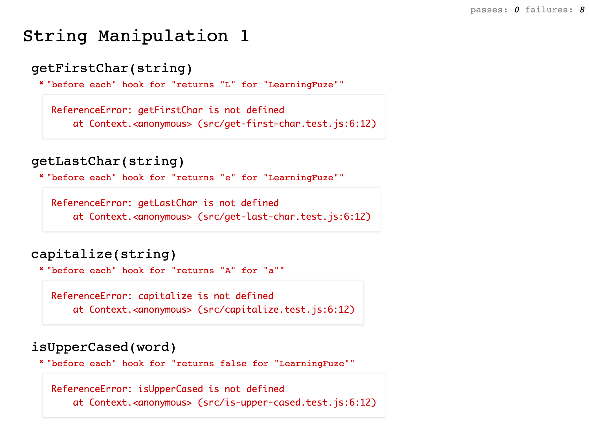

# string-manipulation-1

JavaScript string manipulation practice with unit tests.

## Before You Begin

Be sure to check out a new branch from `main` for this exercise. Detailed instructions can be found [**here**](../../guides/starting-an-exercise).

## Exercise

Remember, `String`s [are Array-like](https://developer.mozilla.org/en-US/docs/Web/JavaScript/Reference/Global_Objects/String#Character_access) and have a lot of [useful methods](https://developer.mozilla.org/en-US/docs/Web/JavaScript/Reference/Global_Objects/String#Methods_2).

For this exercise you will be implementing several generic string manipulation functions. You are given a description of each function, a suite of unit tests for each function, and an empty JavaScript file in which to write your implementation.

Your goal is to define each function according to its description, such that all of its tests pass.

Change directories into `string-manipulation-1`. Use the TypeScript compiler to watch changes in your TypeScript file and compile it to JavaScript. This will compile your TypeScript into JavaScript and watch for any changes you make in your TypeScript file.

```sh
cd string-manipulation-1/src
npx tsc --watch
```

Begin by skimming through `index.html` in your code editor, then opening it in your web browser. You should see **`ReferenceError: ... is not defined`** a few times on the page.

<p align="middle">
  
</p>

Open `src/get-first-char.ts` and `src/get-first-char.test.js` in your code editor and skim the code in `get-first-char.test.js`. As you add to or modify `get-first-char.ts`, reload `index.html` in your browser to receive feedback. Work through defining each function specified below until all unit tests pass.

**Each function should be defined in its own file.**

Then, following the specifications below, complete each of the functions defined in the provided `.ts` files.

1. ### `getFirstChar(string)`

   #### Parameters

   - `string` - Any JavaScript `String`

   #### Return Value

   The first character of `string`.

   #### Examples

   ```js
   getFirstChar("LearningFuze"); // -> "L"
   getFirstChar("paschal"); // -> "p"
   getFirstChar("HTML"); // -> "H"
   getFirstChar("code"); // -> "c"
   getFirstChar("String"); // -> "S"
   ```

1. ### `getLastChar(string)`

   #### Parameters

   - `string` - Any JavaScript `String`

   #### Return Value

   The _last_ character of `string`.

   #### Examples

   ```js
   getLastChar("LearningFuze"); // -> "e"
   getLastChar("paschal"); // -> "l"
   getLastChar("HTML"); // -> "L"
   getLastChar("code"); // -> "e"
   getLastChar("String"); // -> "g"
   ```

1. ### `capitalize(word)`

   #### Parameters

   - `word` - A single word as a JavaScript `String`

   #### Return Value

   The original `word`, but with its first character uppercased and the rest of its characters lowercased.

   #### Examples

   ```js
   capitalize("a"); // -> "A"
   capitalize("link"); // -> "Link"
   capitalize("tO"); // -> "To"
   capitalize("ThE"); // -> "The"
   capitalize("pAsT"); // -> "Past"
   ```

1. ### `isUpperCased(word)`

   #### Parameters

   - `word` - A single word as a JavaScript `String`

   #### Return Value

   A `Boolean` indicating whether or not all characters in `word` are **uppercased**.

   #### Examples

   ```js
   isUpperCased("LearningFuze"); // -> false
   isUpperCased("JavaScript"); // -> false
   isUpperCased("HTML"); // -> true
   isUpperCased("css"); // -> false
   isUpperCased("PHP"); // -> true
   ```

1. ### `isLowerCased(word)`

   #### Parameters

   - `word` - A single word as a JavaScript `String`

   #### Return Value

   A `Boolean` indicating whether or not all characters in `word` are **lowercased**.

   #### Examples

   ```js
   isLowerCased("LearningFuze"); // -> false
   isLowerCased("zip-ties"); // -> true
   isLowerCased("JavaScript"); // -> false
   isLowerCased("burgers"); // -> true
   isLowerCased("HTML"); // -> false
   ```

1. ### `isVowel(char)`

   #### Parameters

   - `char` - A single JavaScript `String` character

   #### Return Value

   A `Boolean` indicating whether or not `char` is a vowel. `isVowel` should handle both uppercase and lowercase characters.

   #### Examples

   ```js
   isVowel("L"); // -> false
   isVowel("f"); // -> false
   isVowel("Z"); // -> false
   isVowel("a"); // -> true
   isVowel("E"); // -> true
   isVowel("I"); // -> true
   isVowel("o"); // -> true
   isVowel("u"); // -> true
   ```

1. ### `getWords(string)`

   #### Parameters

   - `string` - A JavaScript `String` containing zero or more words, separated by spaces.

   #### Return Value

   An `Array` of JavaScript `String`. Each `String` is one of the words in the `string` parameter.

   #### Examples

   ```js
   getWords("LearningFuze");
   // -> ["LearningFuze"]
   getWords("Web Development");
   // -> ["Web", "Development"]
   getWords("Cascading Style Sheets");
   // -> ["Cascading", "Style", "Sheets"]
   getWords("European Computer Manufacturers Association");
   // -> ["European", "Computer", "Manufacturers", "Association"]
   getWords("");
   // -> []
   ```

1. ### `reverseWord(word)`

   🚨 **Do not use `String.prototype.split` for this problem.** 🚨

   #### Parameters

   - `word` - A single word as a JavaScript `String`

   #### Return Value

   A JavaScript `String` containing the characters of `word` in reverse order.

   #### Examples

   ```js
   reverseWord("foo"); // -> "oof"
   reverseWord("rab"); // -> "bar"
   reverseWord("LearningFuze"); // -> "ezuFgninraeL"
   reverseWord("tpircSavaJ"); // -> "JavaScript"
   reverseWord("racecar"); // -> "racecar"
   ```
